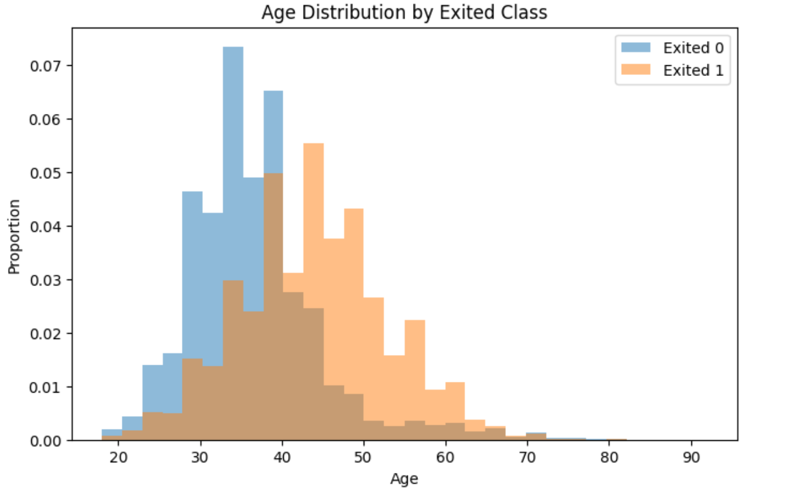
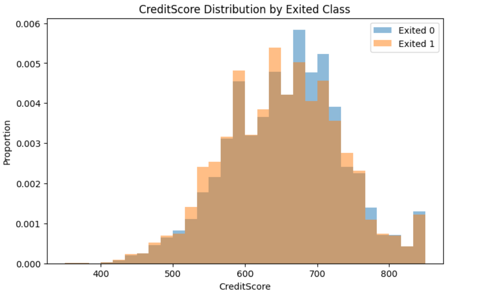
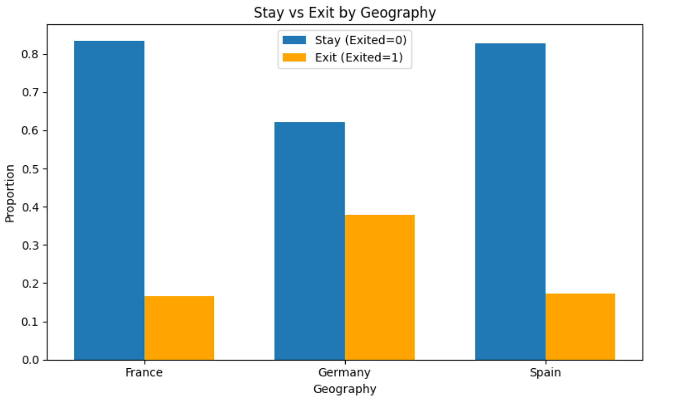
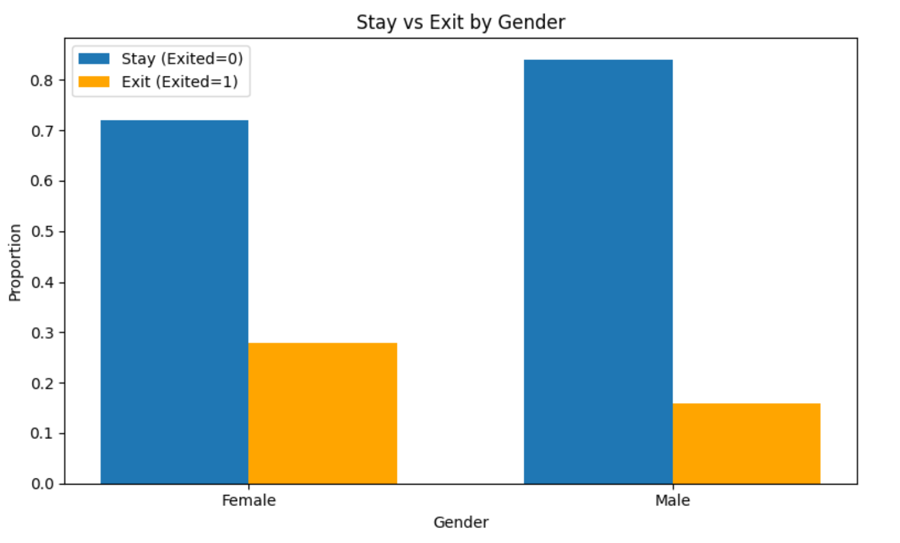
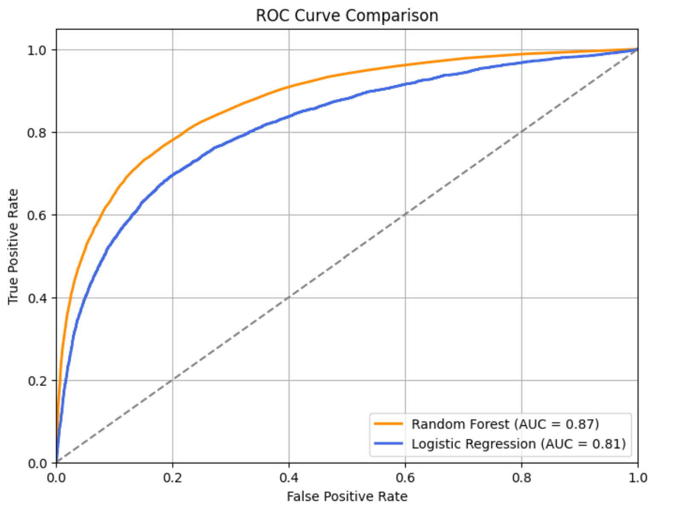

# Customer Churn Prediction Project

## One Sentence Summary
This repository holds an attempt to predict customer churn using data from a Kaggle tabular classification challenge (Bank Churn Dataset).

## Overview
The task was to predict whether a bank customer would exit the bank based on features such as credit score, age, tenure, balance, and others. We approached this as a binary classification problem using Random Forest and Logistic Regression classifiers to model customer behavior. The data was preprocessed by cleaning, applying one-hot encoding to categorical features, and standardizing numerical features. Among the models tested, Random Forest performed best, achieving over 86% accuracy with a good balance between precision and accuracy.
## Summary of Work Done

### Data
Structured tabular data was provided in CSV format, including features such as age, credit score, account balance, and geographical information.

- **Input**: Customer demographic and banking activity features
- **Output**: Churn flag (Exited: 0 = Stayed, 1 = Left)
- **Size**: 
  - Train: ~80%
  - Test: ~20%

### Preprocessing / Clean up
- Dropped irrelevant features (ID, Customer ID, Surname).
- One-hot encoded categorical features (`Geography`, `Gender`).
- Standardized numerical features (`Age`, `CreditScore`, etc.) using `StandardScaler`.

### Data Visualization
To gain insight into the underlying data structure, visual analysis was conducted using normalized histograms and bar plots. These visualizations highlighted meaningful trends in the data — for example, older customers and those with higher account balances appeared more likely to exit. Categorical differences by geography and gender were also explored.

The following key visual techniques were applied:
- Histogram comparisons for numerical features (`Age`, `CreditScore`, etc.) segmented by churn outcome
- Bar plots for categorical variables (`Geography`, `Gender`) to show class-wise distribution
- Identification of the most influential features, such as `Age` and `CreditScore`, based on observed class separation

### Feature Visualizations





---

## Problem Formulation

- **Input**: Customer features after preprocessing.
- **Output**: Binary classification (Exited: 0 or 1).

### Models
- **Random Forest Classifier**: An ensemble of decision trees to improve prediction robustness
- **Logistic Regression**: A baseline linear model for binary classification

Hyperparameters:  
- Random Forest: default settings
- Logistic Regression: max_iter=1000 to ensure convergence

---

## Training
Model training was performed using scikit-learn within a Jupyter Notebook environment, utilizing an 80/20 train-validation split.

- **Software**: Python 3, Jupyter Notebook
- **Libraries**: pandas, numpy, matplotlib, scikit-learn
- **Environment**: Google Colab (CPU instance)

Training took about 5–10 minutes total.

---

## Performance Comparison
The following metrics were used to compare model performance: Accuracy, Precision, Recall, and F1 Score.

| Model                 | Accuracy | Precision | Recall | F1 Score |
|:----------------------|:---------|:----------|:-------|:---------|
| Random Forest          | 0.865    | 0.790     | 0.500  | 0.610    |
| Logistic Regression    | 0.833    | 0.740     | 0.450  | 0.560    |

- **ROC curves** were plotted for model evaluation.
- **Random Forest** performed better across most metrics.

### ROC Curve Comparison



---

## Conclusions
Random Forest proved to be the more effective model for churn prediction, benefiting from its ability to model non-linear relationships and feature interactions. Important predictors included `Age`, `Balance`, and `IsActiveMember`.
This project demonstrates the effectiveness of supervised learning models in solving real-world business classification problems using structured data.

---

## Future Work
Potential areas for further improvement include:
- Experimentation with gradient boosting models (e.g., XGBoost, LightGBM)
- Hyperparameter tuning via cross-validation
- Engineering new features based on customer behavior trends
  
---

## How to Reproduce Results
To reproduce the analysis and results:
1. Clone this repository.
2. Open `KaggleChallenge.ipynb` notebook.
3. Install requirements (`pip install -r requirements.txt` if necessary).
4. Run all cells in order.
5. `submission.csv` will be created fo Kaggle submission.

---

## Overview of Files in Repository

| File | Description |
|:-----|:------------|
| `KaggleChallenge.ipynb` | Main notebook for model training and evaluation |
| `submission.csv` | Final prediction file for Kaggle submission |
| `train.csv` | Training dataset |
| `test.csv` | Test dataset |

---

## Software Setup

- Python 3
- pandas
- numpy
- scikit-learn
- matplotlib

Install all packages using:
```bash
pip install pandas numpy scikit-learn matplotlib
```
## Citation

> Reade, W., & Chow, A. (2024). *Binary Classification with a Bank Churn Dataset*. Kaggle.  
> [Binary Classification with a Bank Churn Dataset](https://www.kaggle.com/competitions/playground-series-s4e1)
